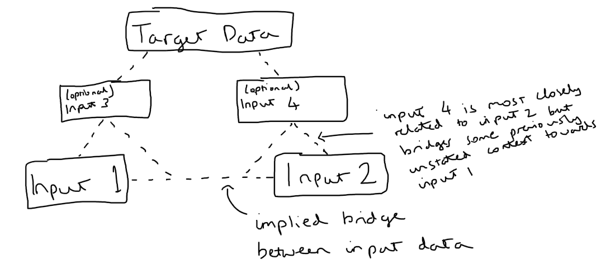
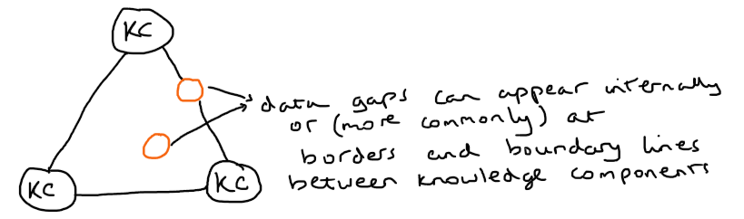
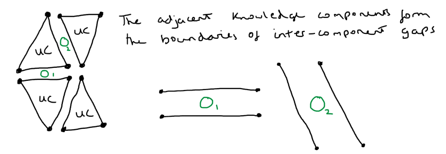
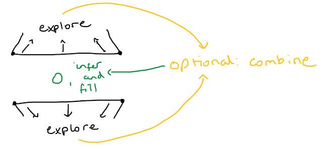
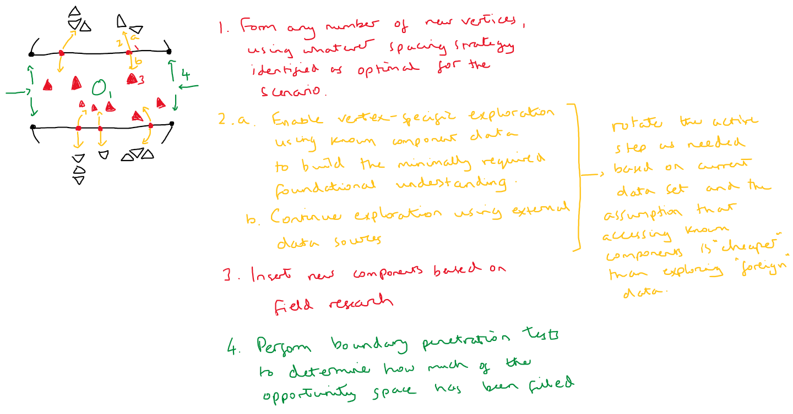

# Building Data Up
Neurons are capable of forming complex connections. Once a final understanding of any data achieved, the most efficient building blocks for inputting that data to a new target can be identified.

Data always expands in the same way: data either builds towards a deeper understanding or builds adding breadth to already achieved levels of understanding.

## Binary search learning: narrowing inwards
Binary search is typically used for search and retrieval. Given the target A that has a complete set of data and the target Z that has no data, it can also be used to identify the minimum viable set of building blocks required to transfer any subset of the data from target A to target Z. 

In short, you take the largest desired dataset and keep adding reduced versions until all required data and connections exist to enable a complete comprehension. 

Difficulty validating comprehension increases linearly with the size of "gaps" between data: gaps in data can be permissed in the presence of an ability to understand, but understanding is significantly harder to validate than knowing itself.

Notice the same core pattern is already repeating. 

Additional data to bridge missed connections (inputs 3 and 4) are just adjusting the local target comprehension in the long term goal towards knowing and understanding the global (original) target data.

The area inside each triangle can be considered the target understanding based on the input data. 

## Split and merge segmentation: dot matrix
Split and merge is a technique used to segment a single object into many pieces and then optimally recompile those pieces back into the complete object.

Instead of continually narrowing the target, a prepared set of subcomponents can be used to construct the target using chunks that are already known effective.

### Understanding components
This is possible in data by relying on blocks of understanding rather than knowledge components.

The exact data input is typically less important than the eventual state of understanding. 

Understanding a topic implies being able to correctly replace knowledge gaps through either introspection or field investigation. That is, being able to fill any missing chunk where adjacent knowledge segments form a shape encompassing that chunk.

> Chunks are the individual pieces that group to form components. Every component is a chunk within a larger component; every chunk is the component surrounding smaller chunks. 

--- 

Missing chunks in a single understanding component:

---

Missing chunks between formal understanding components:

### Chunks between components

Missing chunks inbetween formal understanding components result from either or both missing knowledge and understanding components. Any time required to determine which implies both.

As such, the optimal approach is always to assume and fill using the maximum size understanding component. 

The goal is to sufficiently bridge all adjacent knowledge components. The approach used will vary based on global location, processor specialty, and density. 

---

**Approach 1**: bridge vertices and explore inwards

Bridges may be formed using knowledge components or understanding components. The larger the gap, the more likely an understanding component will better enable filling the entire opportunity space.

Two open ends do not need to be capped by the same component type. Which is used will depend on the the features adjacent to each opening, as well as time constraints and resources available for use. 

---

**Approach 2**: boundary expansion and inference

_Assumption: immediate access is available for data forming adjacent components._

Explore the immediately already-formed components to infer missing data.

All inferred data are considered hypotheses. Unless and until validated, that must be recorded in case of use during subsequent investigations. 

---

**Approach 3**: vertex formation and exploration

Introduce new vertices along known boundaries to create exploration origins. Build foundations and perform exploration either in serial or parallel.

