# Building Data Up
Neurons are capable of forming complex connections. Once a final understanding of any data achieved, the most efficient building blocks for inputting that data to a new target can be identified.

Data always expands in the same way: data either builds towards a deeper understanding or builds adding breadth to already achieved levels of understanding.

## Binary search learning: narrowing inwards
Binary search is typically used for search and retrieval. Given the target A that has a complete set of data and the target Z that has no data, it can also be used to identify the minimum viable set of building blocks required to transfer any subset of the data from target A to target Z. 

In short, you take the largest desired dataset and keep adding reduced versions until all required data and connections exist to enable a complete comprehension. 

Difficulty validating comprehension increases linearly with the size of "gaps" between data: gaps in data can be permissed in the presence of an ability to understand, but understanding is significantly harder to validate than knowing itself.

Notice the same core pattern is already repeating. 

Additional data to bridge missed connections (inputs 3 and 4) are just adjusting the local target comprehension in the long term goal towards knowing and understanding the global (original) target data.

The area inside each triangle can be considered the target understanding based on the input data. 

## Split and merge segmentation: dot matrix
Split and merge is a technique used to segment a single object into many pieces and then optimally recompile those pieces back into the complete object.

Instead of continually narrowing the target, a prepared set of subcomponents can be used to construct the target using chunks that are already known effective.

### Understanding components
This is possible in data by relying on blocks of understanding rather than knowledge components.

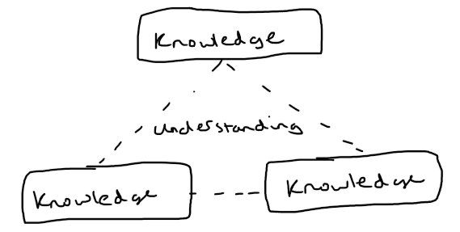

The exact data input is typically less important than the eventual state of understanding. 

Understanding a topic implies being able to correctly replace knowledge gaps through either introspection or field investigation. That is, being able to fill any missing chunk where adjacent knowledge segments form a shape encompassing that chunk.

> Chunks are the individual pieces that group to form components. Every component is a chunk within a larger component; every chunk is the component surrounding smaller chunks. 

--- 

Missing chunks in a single understanding component:

---

Missing chunks between formal understanding components:

### Splitting components

Once the bounds of the component being transferred have been identified, it can be prepared for transfer.

If the transfer method allows the entire component size in one transfer operation, there is no need to split the component before transfer.

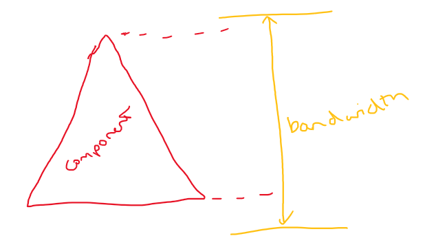

Preparing a component for transfer is as simple as identifying appropriate boundaries, creating chunked data, and then preparing each chunk for transmission. 

Standard protocols are usually agreed on to allowing any receiving end to make use of the seemingly scattered input. 

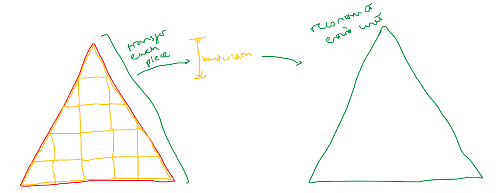

While the unit's end state is appearing to be one piece, the receiver may retain knowledge about the boundaries of each piece input. This is especially important for the sake of error correction in case of any errors during transmission.

Files may be chunked like this for transfer even within a single filesystem, so efficient data storage tools may opt to use a file storage mechanism that always stores data components in chunks. This makes data transit almost trivial since the data is in an always-ready state.

The chunks are not guaranteed to be uniform shapes. This presents optimization opportunities. The component might be reshaped to better enable efficient chunking, or the chunks may be reorganized to try and better enable uniformity between the chunks. 

### Component based teaching

Component based teaching for any data is equivalent to how schools organize into subjects, subjects organize into key themes, and key themes are split down based on available lessons.

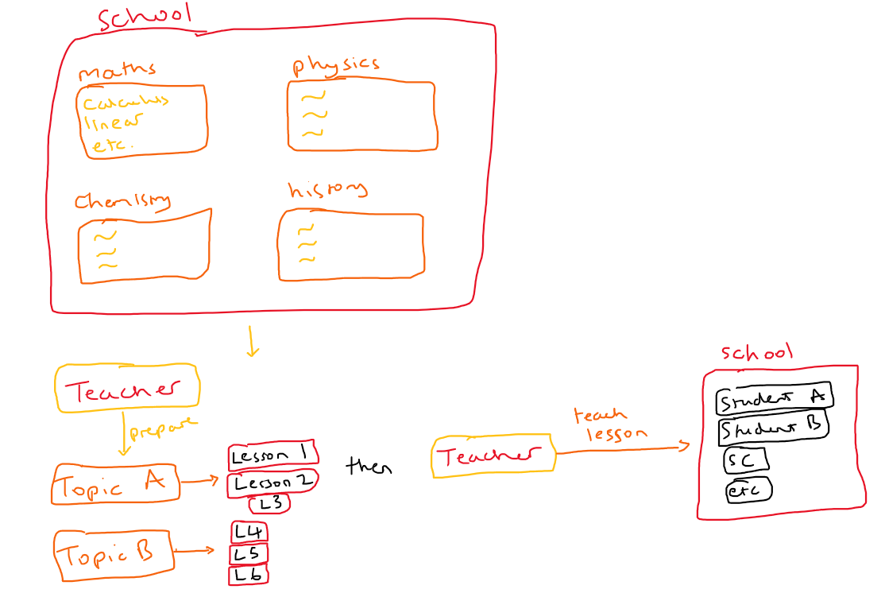

Instant transmission is not always a possiblility. 

This is most commonly the case when the transmitter does not yet know the receiver, the transmitter has multiple wanting recipients, or there is some other restriction on bandwidth that forces delays between sending each chunk.

This forces transmission to operate more like a queue system, where the transmitter will wait for requests and, on receiving a request with appropriate authorization, will pass information out at maximum speed.

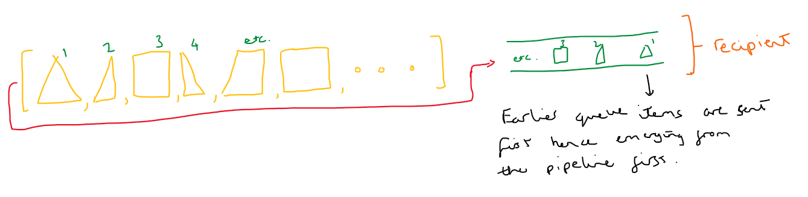

The decision to handle any pre-processing will typically depend on any guaranteed likelihood of future requesting parties.

Bandwidth available is not guaranteed until the requesting party is made apparent. The party with the lower bandwidth limit dictates transfer speed. If a new recipient has bandwidth forcing smaller chunks than the sender has prepared for, transmission will take additional time to account for unforeseen processing.

There will be an additional buffer, between the unforeseen processing and transmission, in case the local chunk processors creates appropriately bitesized pieces at a rate still exceeding the available transmission bandwidth. 

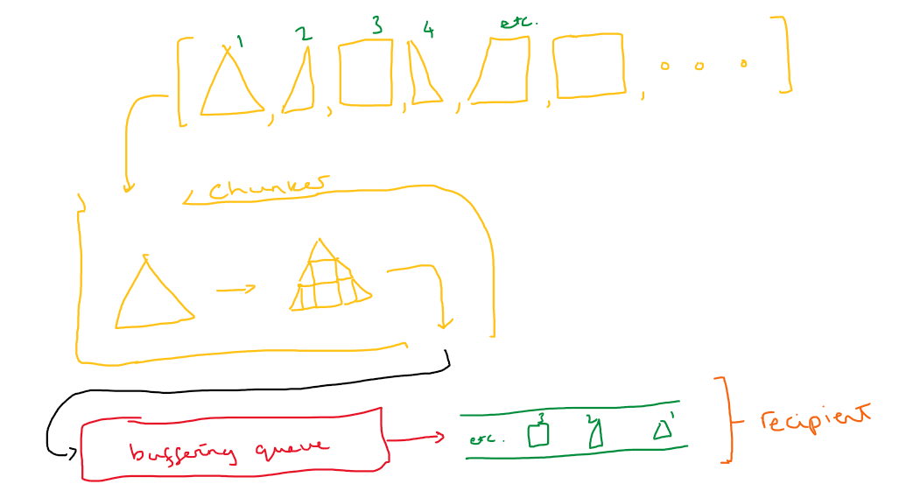

If multiple recipients request transmission the host must calculate whether to fan out the information manually or defer the transmission.

Deferring the transmission could be sending the data at a later time or asking a peer to send the data requested on the host's behalf.

If the recipient ends up gathering the data from a mixture of the host and/or multiple of the host's peers, this forms an equivalent Peer-To-Peer (P2P) network.

Which approach to take depends on a variety of factors mostly focused around host availability, peer availability, bandwidth vs latency requirements, and target location.

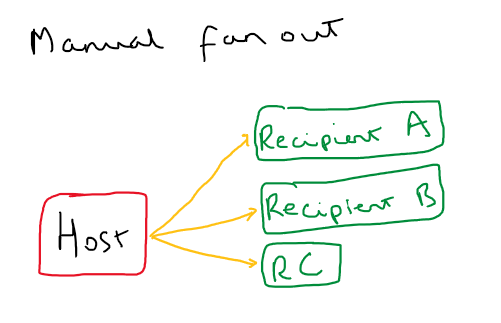

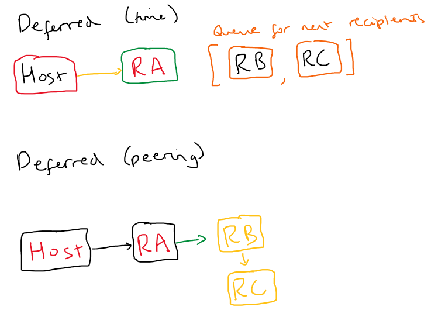

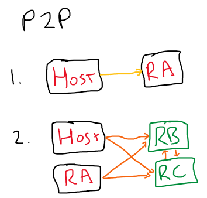

## Chunk filling between components

Missing chunks inbetween formal understanding components result from either or both missing knowledge and understanding components. Any time required to determine which implies both.

As such, the optimal approach is always to assume and fill using the maximum size understanding component. 

The goal is to sufficiently bridge all adjacent knowledge components. The approach used will vary based on global location, processor specialty, and density. 

---

**Approach 1**: bridge vertices and explore inwards

Bridges may be formed using knowledge components or understanding components. The larger the gap, the more likely an understanding component will better enable filling the entire opportunity space.

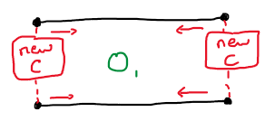

Two open ends do not need to be capped by the same component type. Which is used will depend on the the features adjacent to each opening, as well as time constraints and resources available for use. 

---

**Approach 2**: boundary expansion and inference

_Assumption: immediate access is available for data forming adjacent components._

Explore the immediately already-formed components to infer missing data.

All inferred data are considered hypotheses. Unless and until validated, that must be recorded in case of use during subsequent investigations. 

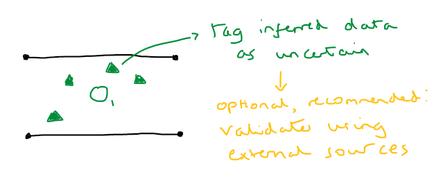

---

**Approach 3**: vertex formation and exploration

Introduce new vertices along known boundaries to create exploration origins. Build foundations and perform exploration either in serial or parallel.

